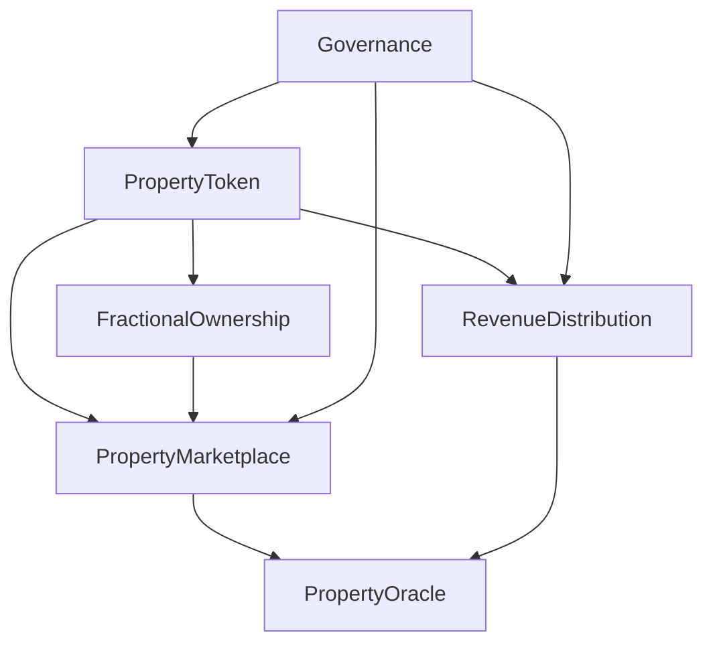

# MAK Platform - Smart Contracts Documentation

> **Blockchain infrastructure for fractional real estate ownership**

[](https://soliditylang.org/)
[](https://hardhat.org/)
[](https://openzeppelin.com/)
[](../license.md)

---

## 📋 Table of Contents

- [Overview](#-overview)
- [Contract Architecture](#-contract-architecture)
- [Core Contracts](#-core-contracts)
- [Contract Interactions](#-contract-interactions)
- [Deployment Status](#-deployment-status)
- [Usage Examples](#-usage-examples)
- [Security Considerations](#-security-considerations)
- [Testing](#-testing)
- [Deployment Guide](#-deployment-guide)
- [Upgradeability](#-upgradeability)

---

## 🎯 Overview

The MAK Platform smart contract suite enables fractional ownership of real estate properties through blockchain tokenization. Our contracts handle everything from property tokenization and marketplace trading to automated revenue distribution and decentralized governance.

### **Design Principles**

1. **Security First**: All contracts follow OpenZeppelin standards and best practices
2. **Gas Optimization**: Efficient storage patterns and minimal on-chain computation
3. **Modularity**: Separated concerns allow independent contract upgrades
4. **Transparency**: All transactions and ownership records are publicly verifiable
5. **Compliance**: Built-in KYC/AML hooks for regulatory requirements

### **Technology Stack**

```
├── Solidity ^0.8.20      # Smart contract language
├── Hardhat              # Development framework
├── OpenZeppelin 5.0     # Security-audited contract libraries
├── Chainlink            # Price oracles and off-chain data
└── EIP Standards        # ERC-1155, ERC-20, ERC-2981
```

---

## 🏗️ Contract Architecture

### **System Overview**

```
┌─────────────────────────────────────────────────────────────┐
│                     MAK Platform Ecosystem                   │
└─────────────────────────────────────────────────────────────┘
                              │
                              ▼
        ┌─────────────────────────────────────────┐
        │         PropertyToken.sol (ERC-1155)     │
        │    ┌─────────────────────────────────┐  │
        │    │  Core Property NFT Management   │  │
        │    └─────────────────────────────────┘  │
        └──────────────┬──────────────────────────┘
                       │
        ┌──────────────┼──────────────┐
        │              │              │
        ▼              ▼              ▼
┌──────────────┐ ┌──────────────┐ ┌──────────────┐
│ Marketplace  │ │   Revenue    │ │  Governance  │
│  Trading &   │ │ Distribution │ │   & Voting   │
│   Pricing    │ │   Automation │ │   Mechanism  │
└──────────────┘ └──────────────┘ └──────────────┘
        │              │              │
        └──────────────┼──────────────┘
                       ▼
        ┌─────────────────────────────┐
        │   PropertyOracle.sol        │
        │  (Chainlink Integration)    │
        │  Real-world data feeds      │
        └─────────────────────────────┘
```

### **Contract Dependencies**



---

## 📜 Core Contracts

### **1. PropertyToken.sol**

**Purpose**: ERC-1155 multi-token standard for representing fractional property ownership.

**Key Features**:
- ✅ Mint property tokens representing real estate assets
- ✅ Each property ID represents a unique real-world property
- ✅ Fractional shares within each property token
- ✅ Built-in royalty mechanism (ERC-2981) for secondary sales
- ✅ Pausable for emergency situations
- ✅ Role-based access control (Admin, Minter, Pauser)

**State Variables**:
```solidity
struct Property {
    string propertyAddress;      // Physical address
    uint256 totalShares;         // Total fractional shares
    uint256 sharePrice;          // Price per share (in wei)
    uint256 rentalIncome;        // Monthly rental income
    bool isActive;               // Property active status
    address originalOwner;       // Initial property owner
    uint256 listingDate;         // When property was tokenized
}

mapping(uint256 => Property) public properties;
mapping(uint256 => string) public propertyMetadata; // IPFS CID
```

**Main Functions**:
```solidity
function tokenizeProperty(
    string memory _propertyAddress,
    uint256 _totalShares,
    uint256 _sharePrice,
    string memory _metadataURI
) external onlyRole(MINTER_ROLE) returns (uint256 propertyId)

function purchaseShares(
    uint256 _propertyId,
    uint256 _shareAmount
) external payable

function transferShares(
    address _to,
    uint256 _propertyId,
    uint256 _amount
) external
```

**Status**: 🚧 In Development
- [x] Base ERC-1155 implementation
- [x] Property struct definition
- [ ] Complete testing coverage
- [ ] Security audit pending
- [ ] Testnet deployment pending

---

### **2. PropertyMarketplace.sol**

**Purpose**: Decentralized exchange for trading fractional property shares.

**Key Features**:
- ✅ Buy/sell orders with limit pricing
- ✅ Automated market maker (AMM) for liquidity
- ✅ Trading fee mechanism (0.5% default)
- ✅ Price discovery through order book
- ✅ Escrow functionality for secure trades

**State Variables**:
```solidity
struct Order {
    address seller;
    uint256 propertyId;
    uint256 shareAmount;
    uint256 pricePerShare;
    uint256 timestamp;
    bool isActive;
}

mapping(uint256 => Order) public sellOrders;
mapping(uint256 => mapping(address => uint256)) public buyOrders;

uint256 public tradingFeePercent = 50; // 0.5% (basis points)
address public feeCollector;
```

**Main Functions**:
```solidity
function createSellOrder(
    uint256 _propertyId,
    uint256 _shareAmount,
    uint256 _pricePerShare
) external returns (uint256 orderId)

function executeBuyOrder(
    uint256 _orderId
) external payable

function cancelOrder(uint256 _orderId) external

function getMarketPrice(uint256 _propertyId) 
    external view returns (uint256)
```

**Trading Fee Distribution**:
```
Total Fee (0.5%)
├── Platform Treasury (60%) → Development & Operations
├── Token Holders (30%)     → MAK governance token stakers
└── Liquidity Providers (10%) → Market makers
```

**Status**: 🚧 In Development
- [x] Order book structure
- [x] Basic buy/sell functions
- [ ] AMM implementation
- [ ] Flash loan protection
- [ ] Testnet deployment pending

---

### **3. RevenueDistribution.sol**

**Purpose**: Automated distribution of rental income to fractional owners.

**Key Features**:
- ✅ Proportional revenue sharing based on ownership percentage
- ✅ Automated monthly distributions via Chainlink Automation
- ✅ Withdrawal pattern for gas optimization
- ✅ Emergency withdrawal mechanism
- ✅ Transparent income tracking

**State Variables**:
```solidity
struct RevenuePool {
    uint256 propertyId;
    uint256 totalRevenue;        // Total collected revenue
    uint256 distributedRevenue;  // Already distributed
    uint256 lastDistribution;    // Timestamp
    mapping(address => uint256) claimable;
}

mapping(uint256 => RevenuePool) public revenuePools;
mapping(address => uint256) public totalEarnings;
```

**Main Functions**:
```solidity
function depositRevenue(uint256 _propertyId) 
    external payable onlyRole(DEPOSITOR_ROLE)

function distributeRevenue(uint256 _propertyId) 
    external onlyRole(DISTRIBUTOR_ROLE)

function claimRevenue(uint256 _propertyId) external

function getClaimableAmount(address _user, uint256 _propertyId) 
    external view returns (uint256)
```

**Distribution Mechanism**:
```solidity
// Revenue distribution formula:
userShare = (userTokens / totalTokens) * totalRevenue
claimable[user] += userShare - previouslyClaimed[user]
```

**Status**: 🚧 In Development
- [x] Core distribution logic
- [x] Withdrawal pattern
- [ ] Chainlink Automation integration
- [ ] Gas optimization
- [ ] Testnet deployment pending

---

### **4. PropertyOracle.sol**

**Purpose**: Bridge between real-world property data and blockchain.

**Key Features**:
- ✅ Chainlink Price Feeds for property valuations
- ✅ MLS (Multiple Listing Service) data integration
- ✅ Rental income verification
- ✅ Property condition reports
- ✅ Multi-source data aggregation

**State Variables**:
```solidity
struct PropertyData {
    uint256 lastAppraisal;    // Last appraised value
    uint256 appraisalDate;    // Timestamp of appraisal
    address appraiser;        // Certified appraiser address
    bool isVerified;          // Verification status
    string dataSource;        // MLS/Zillow/etc
}

mapping(uint256 => PropertyData) public propertyData;
AggregatorV3Interface public priceFeed; // Chainlink oracle
```

**Main Functions**:
```solidity
function updatePropertyValue(
    uint256 _propertyId,
    uint256 _newValue,
    string memory _dataSource
) external onlyRole(ORACLE_ROLE)

function getPropertyValue(uint256 _propertyId) 
    external view returns (uint256)

function verifyRentalIncome(
    uint256 _propertyId,
    uint256 _income
) external onlyRole(VERIFIER_ROLE) returns (bool)
```

**Status**: 🚧 In Development
- [x] Basic oracle structure
- [x] Chainlink integration skeleton
- [ ] MLS API integration
- [ ] Multi-oracle aggregation
- [ ] Testnet deployment pending

---

### **5. Governance.sol**

**Purpose**: Decentralized governance for platform decisions.

**Key Features**:
- ✅ Proposal creation and voting
- ✅ Time-locked execution
- ✅ Quadratic voting mechanism
- ✅ Delegation support
- ✅ Emergency pause authority

**State Variables**:
```solidity
struct Proposal {
    address proposer;
    string description;
    uint256 votesFor;
    uint256 votesAgainst;
    uint256 startTime;
    uint256 endTime;
    bool executed;
    mapping(address => bool) hasVoted;
}

uint256 public proposalThreshold = 100000 * 10**18; // 100k MAK tokens
uint256 public votingPeriod = 7 days;
uint256 public executionDelay = 2 days;
```

**Main Functions**:
```solidity
function propose(
    string memory _description,
    bytes memory _calldata
) external returns (uint256 proposalId)

function vote(uint256 _proposalId, bool _support) external

function execute(uint256 _proposalId) external

function delegate(address _delegatee) external
```

**Status**: 📋 Planned for Q3 2025
- [ ] Governance token design
- [ ] Proposal mechanism
- [ ] Voting logic
- [ ] Time-lock implementation

---

## 🔄 Contract Interactions

### **User Journey: Purchasing Property Shares**

```solidity
// 1. User browses available properties
PropertyToken.getActiveProperties() 
    → returns array of property IDs

// 2. User checks property details
PropertyToken.properties(propertyId) 
    → returns Property struct

// 3. User purchases shares
PropertyToken.purchaseShares(propertyId, shareAmount)
    → Transfers ETH to contract
    → Mints ERC-1155 tokens to user
    → Emits SharePurchased event

// 4. User receives rental income
RevenueDistribution.claimRevenue(propertyId)
    → Calculates claimable amount
    → Transfers ETH to user
    → Updates earnings tracker
```

### **Admin Journey: Tokenizing a Property**

```solidity
// 1. Admin uploads property metadata to IPFS
// Returns: ipfs://QmXxx...

// 2. Admin tokenizes the property
PropertyToken.tokenizeProperty(
    "123 Main St, City, State 12345",
    1000,                    // 1000 shares
    ethers.parseEther("100"), // 100 ETH per share
    "ipfs://QmXxx..."
)
    → Creates new property ID
    → Stores property details
    → Emits PropertyTokenized event

// 3. Oracle updates property value
PropertyOracle.updatePropertyValue(propertyId, appraisedValue, "MLS")

// 4. Revenue distribution setup
RevenueDistribution.depositRevenue(propertyId)
    → Accepts rental income
    → Prepares for distribution
```

---

## 🚀 Deployment Status

### **Current Network Deployments**

| Contract | Network | Address | Status |
|----------|---------|---------|--------|
| PropertyToken | Mainnet | `Not Deployed` | 🚧 In Development |
| PropertyToken | Sepolia | `Not Deployed` | 📋 Planned Q2 2025 |
| Marketplace | Mainnet | `Not Deployed` | 🚧 In Development |
| Marketplace | Sepolia | `Not Deployed` | 📋 Planned Q2 2025 |
| RevenueDistribution | Mainnet | `Not Deployed` | 🚧 In Development |
| RevenueDistribution | Sepolia | `Not Deployed` | 📋 Planned Q2 2025 |

**Legend**:
- 🚧 In Development
- 📋 Planned
- ✅ Deployed
- 🔒 Audited

### **Deployment Checklist**

Before mainnet deployment, we must complete:

- [ ] Comprehensive unit tests (>95% coverage)
- [ ] Integration tests for all contract interactions
- [ ] Gas optimization audit
- [ ] Professional security audit by 2+ firms
- [ ] Formal verification of critical functions
- [ ] Bug bounty program launch
- [ ] Governance token distribution
- [ ] Multi-sig wallet setup for admin functions
- [ ] Emergency pause mechanism testing
- [ ] Testnet beta period (minimum 3 months)

---

## 💻 Usage Examples

### **Example 1: Tokenize a Property**

```solidity
// SPDX-License-Identifier: MIT
pragma solidity ^0.8.20;

import "./PropertyToken.sol";

contract PropertyOnboardingExample {
    PropertyToken public propertyToken;
    
    function tokenizeRentalProperty() external {
        // Upload property documents to IPFS
        string memory metadataURI = "ipfs://QmPropertyDocuments123";
        
        // Tokenize the property
        uint256 propertyId = propertyToken.tokenizeProperty(
            "456 Oak Avenue, San Francisco, CA 94102",
            10000,                           // 10,000 fractional shares
            ethers.parseEther("0.05"),       // 0.05 ETH per share (~$100)
            metadataURI
        );
        
        // Property is now tradeable on the marketplace
        // Total property value: 10,000 * 0.05 = 500 ETH
    }
}
```

### **Example 2: Purchase Property Shares**

```javascript
// Frontend integration example (ethers.js v6)
import { ethers } from 'ethers';

async function purchasePropertyShares(propertyId, shareAmount) {
    const provider = new ethers.BrowserProvider(window.ethereum);
    const signer = await provider.getSigner();
    
    // Connect to PropertyToken contract
    const propertyToken = new ethers.Contract(
        PROPERTY_TOKEN_ADDRESS,
        PropertyTokenABI,
        signer
    );
    
    // Get current share price
    const property = await propertyToken.properties(propertyId);
    const sharePrice = property.sharePrice;
    const totalCost = sharePrice * BigInt(shareAmount);
    
    // Purchase shares
    const tx = await propertyToken.purchaseShares(
        propertyId,
        shareAmount,
        { value: totalCost }
    );
    
    await tx.wait();
    console.log(`Successfully purchased ${shareAmount} shares!`);
    
    // Check your new balance
    const balance = await propertyToken.balanceOf(
        signer.address,
        propertyId
    );
    console.log(`You now own ${balance} shares of property ${propertyId}`);
}
```

### **Example 3: Claim Rental Income**

```javascript
async function claimMyRentalIncome(propertyId) {
    const provider = new ethers.BrowserProvider(window.ethereum);
    const signer = await provider.getSigner();
    
    const revenueDistribution = new ethers.Contract(
        REVENUE_DISTRIBUTION_ADDRESS,
        RevenueDistributionABI,
        signer
    );
    
    // Check claimable amount
    const claimable = await revenueDistribution.getClaimableAmount(
        signer.address,
        propertyId
    );
    
    console.log(`Claimable income: ${ethers.formatEther(claimable)} ETH`);
    
    if (claimable > 0) {
        // Claim revenue
        const tx = await revenueDistribution.claimRevenue(propertyId);
        await tx.wait();
        console.log('Revenue claimed successfully!');
    }
}
```

### **Example 4: List Shares for Sale**

```javascript
async function listSharesForSale(propertyId, shareAmount, pricePerShare) {
    const provider = new ethers.BrowserProvider(window.ethereum);
    const signer = await provider.getSigner();
    
    const propertyToken = new ethers.Contract(
        PROPERTY_TOKEN_ADDRESS,
        PropertyTokenABI,
        signer
    );
    
    const marketplace = new ethers.Contract(
        MARKETPLACE_ADDRESS,
        MarketplaceABI,
        signer
    );
    
    // 1. Approve marketplace to handle your tokens
    const approveTx = await propertyToken.setApprovalForAll(
        MARKETPLACE_ADDRESS,
        true
    );
    await approveTx.wait();
    
    // 2. Create sell order
    const sellTx = await marketplace.createSellOrder(
        propertyId,
        shareAmount,
        ethers.parseEther(pricePerShare.toString())
    );
    
    const receipt = await sellTx.wait();
    const orderId = receipt.logs[0].args.orderId;
    
    console.log(`Sell order created! Order ID: ${orderId}`);
}
```

---

## 🔒 Security Considerations

### **Security Measures Implemented**

1. **Access Control**
   ```solidity
   // Role-based permissions
   bytes32 public constant MINTER_ROLE = keccak256("MINTER_ROLE");
   bytes32 public constant PAUSER_ROLE = keccak256("PAUSER_ROLE");
   bytes32 public constant ORACLE_ROLE = keccak256("ORACLE_ROLE");
   ```

2. **Reentrancy Protection**
   ```solidity
   // Using OpenZeppelin's ReentrancyGuard
   function purchaseShares(uint256 _propertyId, uint256 _amount) 
       external payable nonReentrant {
       // Safe from reentrancy attacks
   }
   ```

3. **Integer Overflow Protection**
   ```solidity
   // Solidity 0.8.x has built-in overflow checks
   // Using SafeMath patterns for extra safety
   ```

4. **Emergency Controls**
   ```solidity
   // Pausable functionality
   function pause() external onlyRole(PAUSER_ROLE) {
       _pause();
   }
   
   function unpause() external onlyRole(PAUSER_ROLE) {
       _unpause();
   }
   ```

### **Known Limitations & Future Improvements**

⚠️ **Current Limitations**:
- No flash loan protection in marketplace (planned for v2)
- Oracle relies on single data source (multi-oracle aggregation planned)
- No slippage protection in AMM (to be added)
- Gas costs may be high for small transactions

✅ **Planned Security Enhancements**:
- [ ] Multi-signature requirement for critical functions
- [ ] Time-locks for admin actions
- [ ] Rate limiting on high-value transactions
- [ ] Circuit breakers for extreme market conditions
- [ ] Formal verification of core contracts

### **Audit Status**

| Audit Type | Status | Expected Date |
|------------|--------|---------------|
| Internal Code Review | 🚧 In Progress | Q1 2025 |
| Automated Tools (Slither, Mythril) | 📋 Planned | Q2 2025 |
| Professional Audit Firm #1 | 📋 Planned | Q2 2025 |
| Professional Audit Firm #2 | 📋 Planned | Q3 2025 |
| Public Bug Bounty | 📋 Planned | Q3 2025 |

---

## 🧪 Testing

### **Running Tests**

```bash
# Install dependencies
npm install

# Compile contracts
npx hardhat compile

# Run all tests
npx hardhat test

# Run specific test file
npx hardhat test test/PropertyToken.test.js

# Run with gas reporting
REPORT_GAS=true npx hardhat test

# Generate coverage report
npx hardhat coverage
```

### **Test Coverage Goals**

| Contract | Current Coverage | Target Coverage |
|----------|-----------------|-----------------|
| PropertyToken | 🚧 TBD | >95% |
| Marketplace | 🚧 TBD | >95% |
| RevenueDistribution | 🚧 TBD | >95% |
| PropertyOracle | 🚧 TBD | >90% |
| Governance | 🚧 TBD | >95% |

### **Test Structure**

```
test/
├── unit/
│   ├── PropertyToken.test.js
│   ├── Marketplace.test.js
│   ├── RevenueDistribution.test.js
│   └── PropertyOracle.test.js
├── integration/
│   ├── EndToEnd.test.js
│   └── CrossContract.test.js
├── security/
│   ├── Reentrancy.test.js
│   ├── AccessControl.test.js
│   └── EdgeCases.test.js
└── helpers/
    ├── fixtures.js
    └── utils.js
```

---

## 📦 Deployment Guide

### **Prerequisites**

```bash
# Install dependencies
npm install

# Create .env file
cp .env.example .env

# Required environment variables:
PRIVATE_KEY=your_wallet_private_key
SEPOLIA_RPC_URL=your_alchemy_or_infura_url
ETHERSCAN_API_KEY=for_contract_verification
```

### **Deploy to Testnet (Sepolia)**

```bash
# 1. Compile contracts
npx hardhat compile

# 2. Deploy to Sepolia
npx hardhat run scripts/deploy.js --network sepolia

# 3. Verify on Etherscan
npx hardhat verify --network sepolia DEPLOYED_ADDRESS "Constructor Args"
```

### **Deployment Script Example**

```javascript
// scripts/deploy.js
const { ethers } = require("hardhat");

async function main() {
    const [deployer] = await ethers.getSigners();
    console.log("Deploying contracts with account:", deployer.address);
    
    // 1. Deploy PropertyToken
    const PropertyToken = await ethers.getContractFactory("PropertyToken");
    const propertyToken = await PropertyToken.deploy();
    await propertyToken.waitForDeployment();
    console.log("PropertyToken deployed to:", await propertyToken.getAddress());
    
    // 2. Deploy Marketplace
    const Marketplace = await ethers.getContractFactory("PropertyMarketplace");
    const marketplace = await Marketplace.deploy(
        await propertyToken.getAddress()
    );
    await marketplace.waitForDeployment();
    console.log("Marketplace deployed to:", await marketplace.getAddress());
    
    // 3. Deploy RevenueDistribution
    const RevenueDistribution = await ethers.getContractFactory("RevenueDistribution");
    const revenueDistribution = await RevenueDistribution.deploy(
        await propertyToken.getAddress()
    );
    await revenueDistribution.waitForDeployment();
    console.log("RevenueDistribution deployed to:", await revenueDistribution.getAddress());
    
    // 4. Grant roles
    const MINTER_ROLE = await propertyToken.MINTER_ROLE();
    await propertyToken.grantRole(MINTER_ROLE, deployer.address);
    console.log("Roles configured successfully");
}

main()
    .then(() => process.exit(0))
    .catch((error) => {
        console.error(error);
        process.exit(1);
    });
```

---

## 🔄 Upgradeability

### **Upgrade Strategy**

We use the **Transparent Proxy Pattern** for upgradeable contracts:

```
User → Proxy Contract → Implementation Contract
         ↓
    Admin Functions
```

**Benefits**:
- Fix bugs without losing state
- Add new features post-deployment
- Maintain same contract address

**Safeguards**:
- Multi-sig required for upgrades
- 48-hour time-lock on upgrades
- Community governance vote required
- Comprehensive testing on testnet first

### **Emergency Response Plan**

In case of critical vulnerability:

1. **Immediate**: Pause affected contracts
2. **Assessment**: Security team analyzes issue (< 2 hours)
3. **Communication**: Notify users via all channels
4. **Fix**: Deploy patch to testnet
5. **Testing**: Comprehensive security review
6. **Deployment**: Upgrade mainnet after approval
7. **Post-Mortem**: Public report on incident

---

## 📚 Additional Resources

- **[Hardhat Documentation](https://hardhat.org/docs)** - Development framework
- **[OpenZeppelin Contracts](https://docs.openzeppelin.com/contracts/)** - Security standards
- **[Chainlink Documentation](https://docs.chain.link/)** - Oracle integration
- **[Etherscan](https://etherscan.io/)** - Blockchain explorer
- **[Remix IDE](https://remix.ethereum.org/)** - Online Solidity IDE

---

## 🤝 Contributing

Found a bug or have a feature suggestion? 

1. Check existing [GitHub Issues](https://github.com/andrewk529/mak-platform/issues)
2. Open a new issue with detailed description
3. For code contributions, see [CONTRIBUTING.md](../CONTRIBUTING.md)

---

## 📞 Support

**Security Issues**: andrewk529@protonmail.com (PGP key available)  
**General Questions**: [GitHub Discussions](https://github.com/andrewk529/mak-platform/discussions)  
**Developer Chat**: Discord (Coming Soon)

---

## 📄 License

This project is licensed under the MIT License - see the [LICENSE](../license.md) file for details.

---

<div align="center">

**Built with ❤️ by the MAK Platform Team**

[Main README](../README.md) • [Documentation](../docs/) • [Tests](../test/)

</div>
